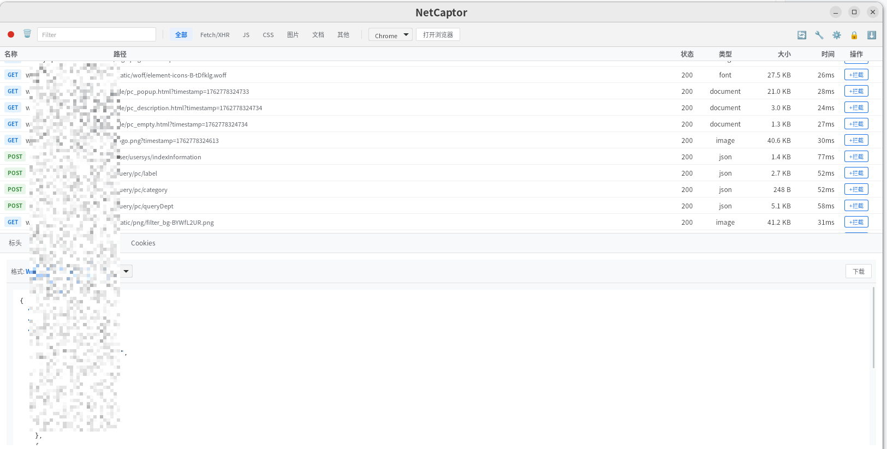
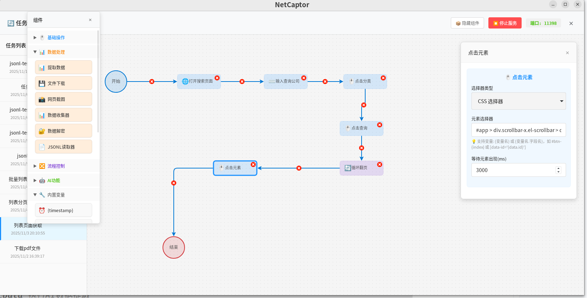
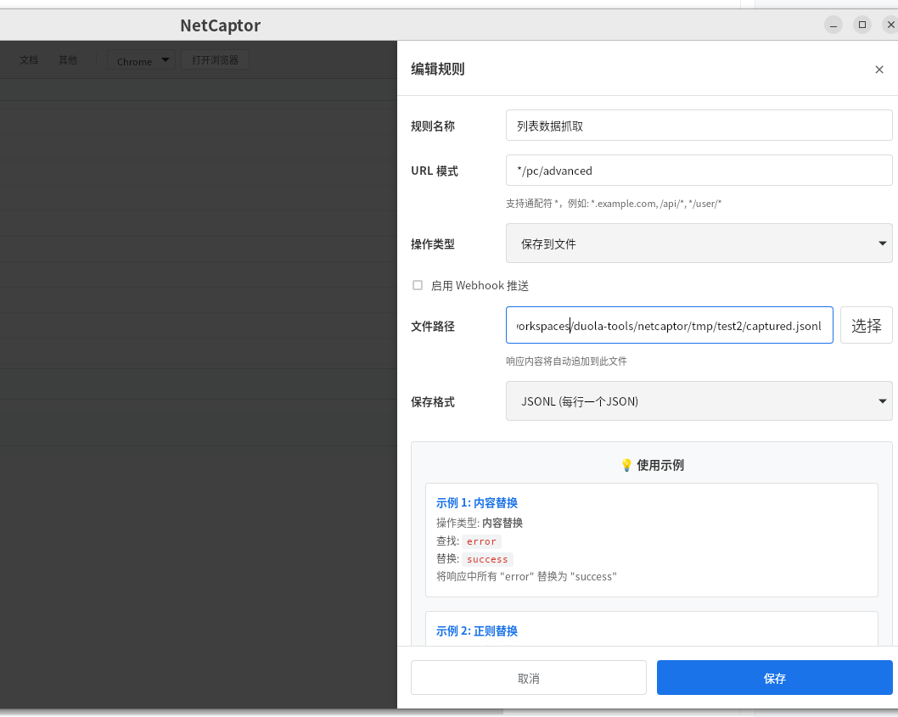
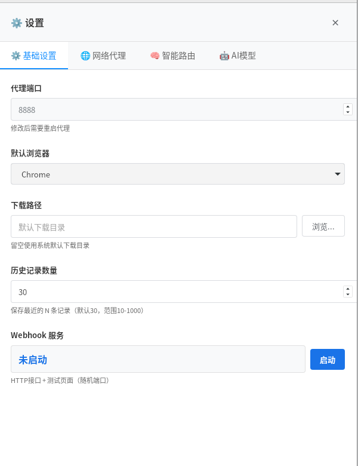
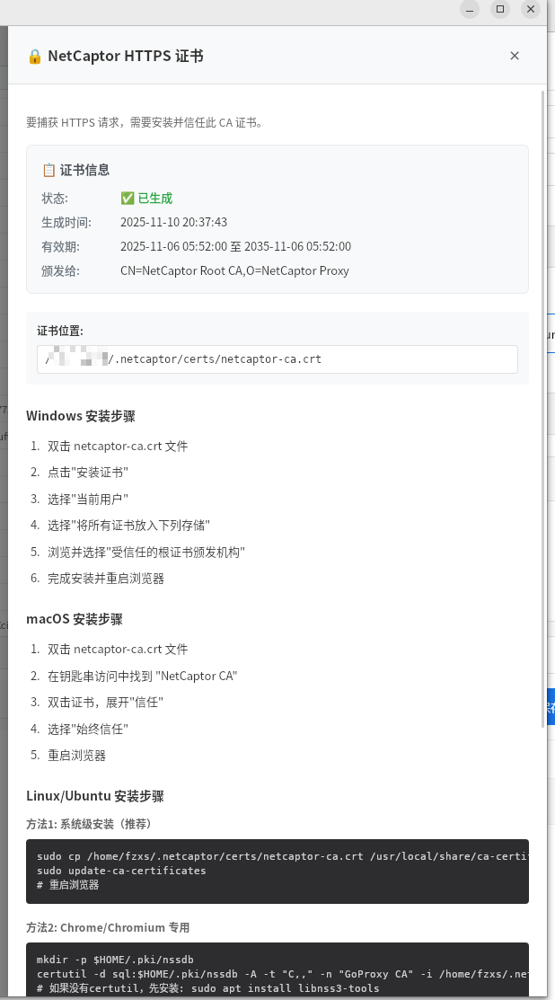

# 🌐 NetCaptor

<div align="center">


**Powerful Network Packet Capture & Analysis Tool**

Cross-platform network traffic capture tool built with Wails + Go + Vue3

[](https://github.com/16chusi/tools-netcaptor/stargazers)
[](https://github.com/16chusi/tools-netcaptor/network)
[](https://github.com/16chusi/tools-netcaptor/issues)
[](LICENSE)

[](https://golang.org/)
[](https://wails.io/)
[](https://vuejs.org/)
[](https://www.typescriptlang.org/)

[](https://github.com/16chusi/tools-netcaptor/releases)
[](https://github.com/16chusi/tools-netcaptor/releases)
[](https://github.com/16chusi/tools-netcaptor/commits)

[🚀 Features](#-features) • [⚡ Quick Start](#-quick-start) • [📖 Usage Guide](#-usage-guide) • [🛠️ Tech Stack](#-tech-stack) • [📸 Screenshots](#-screenshots) • [🤝 Contributing](#-contributing)

---

**⭐ If this project helps you, please give it a Star!**

</div>

---

## ✨ Features

### 🔍 Network Packet Capture
- **HTTP/HTTPS Interception**: Transparent proxy based on GoProxy with HTTPS traffic decryption
- **Real-time Monitoring**: Live capture and display of network requests
- **Smart Filtering**: Quick filtering by type (Fetch/XHR, JS, CSS, Images, Documents)
- **Detailed Information**: View complete request headers, response headers, payloads, and response content

### 📊 Data Analysis
- **Chrome DevTools Style**: Familiar interface design with zero learning curve
- **Performance Metrics**: Display request duration, response size, and other key metrics
- **Content Preview**:
  - Automatic JSON formatting
  - HTML rendering preview
  - Direct image display
  - PDF browser opening
  - Multiple encoding views (text, hexadecimal, Base64)

### 🛠️ Development Tools
- **Request Replay**: One-click generation of cURL, PowerShell, Fetch code
- **Quick Copy**: Copy request code to clipboard
- **Data Export**: Export filtered network data as JSON
- **Multi-browser Support**: One-click launch for Chrome, Edge, Firefox

### 🔐 Security Features
- **Self-signed Certificates**: Automatic generation and management of CA certificates
- **Cross-platform Certificate Installation**: Support for Windows, macOS, Linux
- **Custom Ports**: Avoid port conflicts with random test port allocation

### ⚙️ Flexible Configuration
- **Proxy Port Settings**: Customize proxy listening port
- **Download Path Management**: Visual selection of download directory
- **Default Browser**: Configure commonly used browsers
- **Custom URLs**: Set default test pages to open

### 🔄 Workflow Orchestration
- **Visual Task Flow**: Create automated task flows by dragging and dropping nodes (such as "Navigate", "Click", "Input Text")
- **Process Automation**: Implement complex browser operation sequences without coding, for automated testing or data collection

### 🧩 Browser Extension Integration
- **WebSocket Communication**: Built-in WebSocket service that can integrate with the companion [browser extension](../chrome-extension/README.md) for deeper browser integration and interaction

---

## 🚀 Quick Start

### Requirements

- **Go**: 1.23 or higher (consistent with go.mod)
- **Node.js**: 14 or higher
- **Wails CLI**: v2.10.2

### One-click Installation

```bash
# Clone the project
git clone <repository-url>
cd netcaptor/tools-netcaptor

# One-click install all dependencies
chmod +x quick-start.sh
./quick-start.sh

# Start the application
./run.sh
```

### Manual Installation

#### 1. Install Go Environment

```bash
# Download Go 1.23+
wget https://go.dev/dl/go1.25.1.linux-amd64.tar.gz
tar -xzf go1.25.1.linux-amd64.tar.gz -C ~/go/

# Set environment variables
export PATH="$HOME/go/go1.25.1/bin:$HOME/go/bin:$PATH"
export GOROOT="$HOME/go/go1.25.1"
export GOPATH="$HOME/go"
```

#### 2. Install Wails

```bash
go install github.com/wailsapp/wails/v2/cmd/wails@latest
```

#### 3. Install Dependencies

```bash
cd tools-netcaptor
go mod tidy
cd frontend
npm install
cd ..
```

#### 4. Install Playwright Browsers

```bash
# Install Playwright browser drivers (required)
go run github.com/playwright-community/playwright-go/cmd/playwright@v0.4702.0 install

# If you only need Chromium
go run github.com/playwright-community/playwright-go/cmd/playwright@v0.4702.0 install chromium
```

> **Note**: Playwright needs to download browser drivers, first installation may take several minutes.

#### 5. Start Development Mode

```bash
wails dev -tags webkit2_41
```

---

## 📖 Usage Guide

### Basic Usage

1. **Start Proxy**
   - Click the ● button in the toolbar to start the proxy server
   - Default port: 8888 (can be modified in settings)

2. **Configure Browser**
   - Click "Open Browser" button to automatically configure proxy
   - Or manually set browser proxy to `127.0.0.1:8888`

3. **Capture Traffic**
   - Visit any website in the browser
   - Requests will be displayed in real-time in the list

4. **View Details**
   - Click any request to view detailed information
   - Switch tabs to view headers, payload, response, request code

### HTTPS Packet Capture

1. **Install Certificate**
   - Click the 🔒 button in the toolbar
   - Follow the installation steps for your system
   - Certificate location: `~/.netcaptor/certs/netcaptor-ca.crt`

2. **System Installation Guide**

   **Windows:**
   ```
   1. Double-click the netcaptor-ca.crt file
   2. Click "Install Certificate" → Select "Current User"
   3. Select "Place all certificates in the following store"
   4. Browse and select "Trusted Root Certification Authorities"
   5. Complete installation and restart browser
   ```

   **macOS:**
   ```
   1. Double-click the netcaptor-ca.crt file
   2. Find "NetCaptor CA" in Keychain Access
   3. Double-click the certificate, expand "Trust"
   4. Select "Always Trust"
   5. Restart browser
   ```

   **Linux:**
   ```bash
   sudo cp ~/.netcaptor/certs/netcaptor-ca.crt /usr/local/share/ca-certificates/netcaptor.crt
   sudo update-ca-certificates
   # Restart browser
   ```

### Advanced Features

#### Filter Requests
- Use top filter tabs for quick filtering: All, Fetch/XHR, JS, CSS, Images, Documents, Other
- Enter keywords in the search box for text filtering

#### Export Data
- Click the ⬇️ button to export currently filtered requests
- Supports JSON format with complete request and response information

#### Generate Request Code
1. Select any request
2. Switch to "Request" tab
3. Select format: cURL, PowerShell, Fetch
4. Click "Copy" button

#### View Response Content
- **Auto Recognition**: Automatically select viewing method based on Content-Type
- **Manual Switch**: Select viewing format from dropdown menu
- **PDF/Images**: Click "Open in Browser" or "Download and Open"

---

## 🛠️ Tech Stack

### Backend
- **Go 1.23**: High-performance backend language
- **Wails v2**: Cross-platform desktop application framework
- **GoProxy**: HTTP/HTTPS proxy server
- **ChromeDP**: Browser automation (for standalone web scraping features, not core proxy capture)
- **Playwright-Go**: Browser automation (for standalone web scraping features, not core proxy capture)

### Frontend
- **Vue 3**: Progressive JavaScript framework
- **TypeScript**: Type-safe JavaScript
- **Vite**: Fast frontend build tool

### Core Libraries
- `github.com/elazarl/goproxy` - HTTP proxy
- `github.com/wailsapp/wails/v2` - Desktop application framework
- `github.com/chromedp/chromedp` - Chrome DevTools Protocol
- `github.com/playwright-community/playwright-go` - Browser automation

---

## 📸 Screenshots

### Main Interface


### Request Orchestration


### Interception Rules


### Interception Settings


### Certificate Installation


---

## 🔧 Development Guide

### Project Structure

```
tools-netcaptor/
├── frontend/              # Vue3 frontend
│   ├── src/
│   │   ├── components/   # Vue components
│   │   └── App.vue       # Main application
│   └── wailsjs/          # Wails generated bindings
├── *.go                  # Go backend code
├── wails.json            # Wails configuration
└── README.md             # Project documentation
```

### Build Production Version

```bash
# Build all platforms
wails build

# Build specific platform
wails build -platform linux/amd64
wails build -platform windows/amd64
wails build -platform darwin/amd64
```

### Debugging

```bash
# Start development mode (hot reload)
wails dev -tags webkit2_41
```

### Common Issues

#### Playwright Driver Issues

If you encounter "please install the driver" error:

```bash
go run github.com/playwright-community/playwright-go/cmd/playwright@v0.4702.0 install
```

#### Browser Not Opening

Check browser installation:

```bash
# View installed browsers
ls ~/.cache/ms-playwright/

# Reinstall Chromium
go run github.com/playwright-community/playwright-go/cmd/playwright@v0.4702.0 install chromium
```

#### Port Conflicts

Check and release ports:

```bash
# Check port usage
lsof -i :8888
lsof -i :5173

# Kill occupying process
kill -9 <PID>
```

---

## 🤝 Contributing

Issues and Pull Requests are welcome!

### Development Workflow
1. Fork this repository
2. Create feature branch (`git checkout -b feature/AmazingFeature`)
3. Commit changes (`git commit -m 'Add some AmazingFeature'`)
4. Push to branch (`git push origin feature/AmazingFeature`)
5. Open Pull Request

---

## 📝 License

This project is licensed under the Apache License 2.0 - see the [LICENSE](LICENSE) file for details

```
Copyright 2024 NetCaptor Contributors

Licensed under the Apache License, Version 2.0 (the "License");
you may not use this file except in compliance with the License.
You may obtain a copy of the License at

    http://www.apache.org/licenses/LICENSE-2.0

Unless required by applicable law or agreed to in writing, software
distributed under the License is distributed on an "AS IS" BASIS,
WITHOUT WARRANTIES OR CONDITIONS OF ANY KIND, either express or implied.
See the License for the specific language governing permissions and
limitations under the License.
```

---

## ⚠️ Disclaimer

This tool is for educational and legal purposes only. Please comply with relevant laws and website terms of use. Users are solely responsible for any legal consequences arising from the use of this tool.

---

<div align="center">

## 📮 Contact

[](mailto:fzxs88@yeah.net)
[](https://github.com/16chusi)
[](https://github.com/16chusi/tools-netcaptor/issues)

---

### 🌟 Project Stats


### 📈 Star History

[](https://star-history.com/#16chusi/tools-netcaptor&Date)

---

**If this project helps you, please give it a ⭐️**

**Made with ❤️ by [fzxs](https://github.com/16chusi)**

*NetCaptor - Making network packet capture simple and powerful*

</div>
